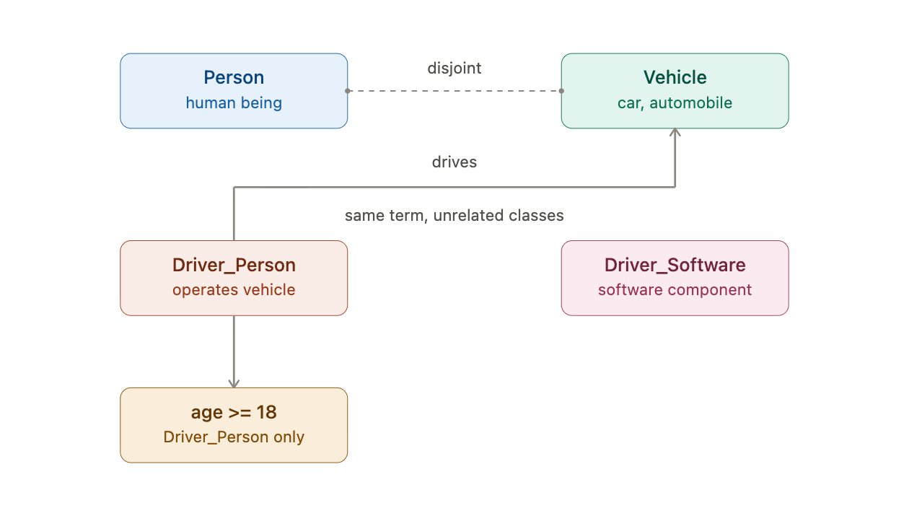

# Version 1
## Elements of the Ontology

| Element | Example |
|---|---|
| Concept | `:Vehicle` |
| Relationship | `:drives` (Person → Vehicle) |
| Synonyms | "Car", "Automobile" as `skos:altLabel` on the *same* `:Vehicle` |
| Homonyms | `:Driver_Person` vs `:Driver_Software` — same label, deliberately unrelated classes |
| Constraint | age ≥ 18 restriction before an instance may be typed `:Driver_Person` |

The homonym case is the one people usually model wrong — they merge both senses into one `:Driver` class with two "meanings" as annotations, which silently creates false equivalence. Modeling them as disjoint classes is what actually prevents an AI system from treating "update the driver" (software) and "the driver's license" (person) as the same entity.




# Version 2

```
Driver_Person ≡ Person ⊓ (hasAge some [>=18])
```

This reads: "X is a Driver_Person if and only if X is a Person aged ≥18." It's a biconditional (≡ = equals). Because it's bidirectional, the reasoner can go either direction — including inferring new class memberships from data it already has.

Why called equivalentClass: the OWL construct literally asserts that two class expressions denote the same set of individuals — Driver_Person and (Person ⊓ hasAge≥18) are declared equivalent, not one subsumed by the other. That symmetry is exactly what licenses forward inference (classification) instead of just backward consistency-checking.

# Version 3
Why is the Version still wrong?
Should use the ??? pattern.